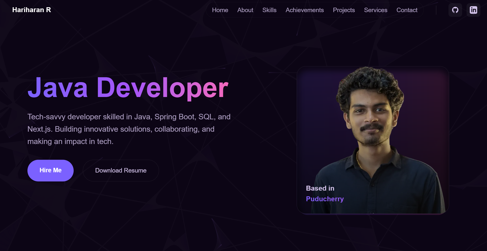

# Personal Portfolio

Welcome to my personal portfolio! This project showcases my skills, projects, and services in a sleek and responsive design, built with cutting-edge technologies.



## Features

- **Fully Responsive**: Works seamlessly on all devices.

- **Smooth Animations**: Powered by Framer Motion for a dynamic UI experience.
- **SEO Optimized**: Structured metadata for better search engine visibility.
- **Modular Design**: Built with reusable Next.js components.

## Tech Stack

- **Framework**: Next.js (React-based framework)
- **Styling**: Tailwind CSS for efficient styling
- **Animations**: Framer Motion for smooth interactions
- **Deployment**: Vercel (Fast and scalable hosting)

````

## Installation & Setup
```bash
# Clone the repository
git clone https://github.com/Hariharan1893/hariharanr1893.git

# Navigate to the project folder
cd hariharanr1893

# Install dependencies
npm install

# Start the development server
npm run dev
````

## Deployment

This portfolio is deployed on **Vercel** for seamless performance and global availability. To deploy your own version:

```bash
npm run build
vercel deploy
```

## Contact

Feel free to connect with me!

- **Portfolio**: [hariharanr1893.vercel.app/](https://hariharanr1893.vercel.app/)
- **Email**: hariramesh1893@gmail.com
- **LinkedIn**: [hlinkedin.com/in/hariharanr18/](https://www.linkedin.com/in/hariharanr18/)

Thank you for visiting my portfolio!
